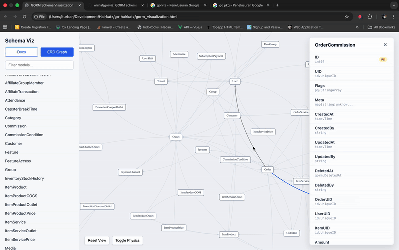

# Gorviz - GORM Visualization Tool

## Project Title
Gorviz

## Description
Gorviz is a command-line interface (CLI) tool designed to help Go developers visualize their GORM (Go Object Relational Mapper) models and their relationships. It parses Go source files to extract GORM model definitions and then generates an interactive HTML ERD (Entity-Relationship Diagram) for better understanding of the database schema.

## Features
*   **GORM Model Parsing:** Scans Go project directories to identify and parse GORM model structs and their associated fields, types, and GORM tags.
*   **Relationship Extraction:** Automatically detects various GORM relationships (e.g., `HasOne`, `HasMany`, `BelongsTo`, `Many2Many`, and `Embedded` structs).
*   **YAML Schema Generation:** Generates an intermediate `schema.yaml` file containing a structured representation of the extracted GORM models and their relationships.
*   **Interactive HTML ERD:** Compiles the YAML schema into a single, static HTML file (`gorviz.html`) that provides:
    *   A browsable list of all detected models with their fields and tags.
    *   An interactive Entity-Relationship Diagram (ERD) powered by `vis-network.js` to visually represent model connections.
    *   Dynamic filtering and model detailing within the HTML view.

## Installation
To install the `gorviz` tool, make sure you have Go installed (version 1.25 or later). Then run:
```bash
go install github.com/wirnat/gorviz@latest
```

### Troubleshooting: "command not found"

If you run `gorviz` and see `zsh: command not found: gorviz` (or similar), it means your Go bin directory is not in your system's `PATH`.

To fix this permanently, add the Go bin directory to your shell configuration:

**For Zsh (macOS/Linux default):**
```bash
echo 'export PATH=$PATH:$(go env GOPATH)/bin' >> ~/.zshrc
source ~/.zshrc
```

**For Bash:**
```bash
echo 'export PATH=$PATH:$(go env GOPATH)/bin' >> ~/.bashrc
source ~/.bashrc
```

## Usage
The tool operates in two main steps: `init` to parse your Go code and generate a schema, and `compile` to create the HTML visualization.

1.  **Generate `schema.yaml`:**
    Navigate to the root of your Go project (or specify the path) and run the `init` command, providing the path to your GORM models.
    ```bash
    gorviz init ./path/to/your/models
    ```
    Replace `./path/to/your/models` with the actual directory containing your GORM model definitions. This will create a `schema.yaml` file in the current working directory.

2.  **Compile to HTML:**
    Once `schema.yaml` is generated, run the `compile` command to produce the interactive HTML visualization.
    ```bash
    gorviz compile
    ```
    This will generate a `gorviz.html` file in the current working directory. Open this file in your web browser to view your GORM schema ERD.

## Demo


## Contributing
We welcome contributions! Please feel free to fork the repository, create a feature branch, commit your changes, and open a pull request.

## License
This project is licensed under the MIT License.

```
MIT License

Copyright (c) 2025 Wiranatha

Permission is hereby granted, free of charge, to any person obtaining a copy
of this software and associated documentation files (the "Software"), to deal
in the Software without restriction, including without limitation the rights
to use, copy, modify, merge, publish, distribute, sublicense, and/or sell
copies of the Software, and to permit persons to whom the Software is
furnished to do so, subject to the following conditions:

The above copyright notice and this permission notice shall be included in all
copies or substantial portions of the Software.

THE SOFTWARE IS PROVIDED "AS IS", WITHOUT WARRANTY OF ANY KIND, EXPRESS OR
IMPLIED, INCLUDING BUT NOT LIMITED TO THE WARRANTIES OF MERCHANTABILITY,
FITNESS FOR A PARTICULAR PURPOSE AND NONINFRINGEMENT. IN NO EVENT SHALL THE
AUTHORS OR COPYRIGHT HOLDERS BE LIABLE FOR ANY CLAIM, DAMAGES OR OTHER
LIABILITY, WHETHER IN AN ACTION OF CONTRACT, TORT OR OTHERWISE, ARISING FROM,
OUT OF OR IN CONNECTION WITH THE SOFTWARE OR THE USE OR OTHER DEALINGS IN THE
SOFTWARE.
```
For the full license text, see the [LICENSE](LICENSE) file.